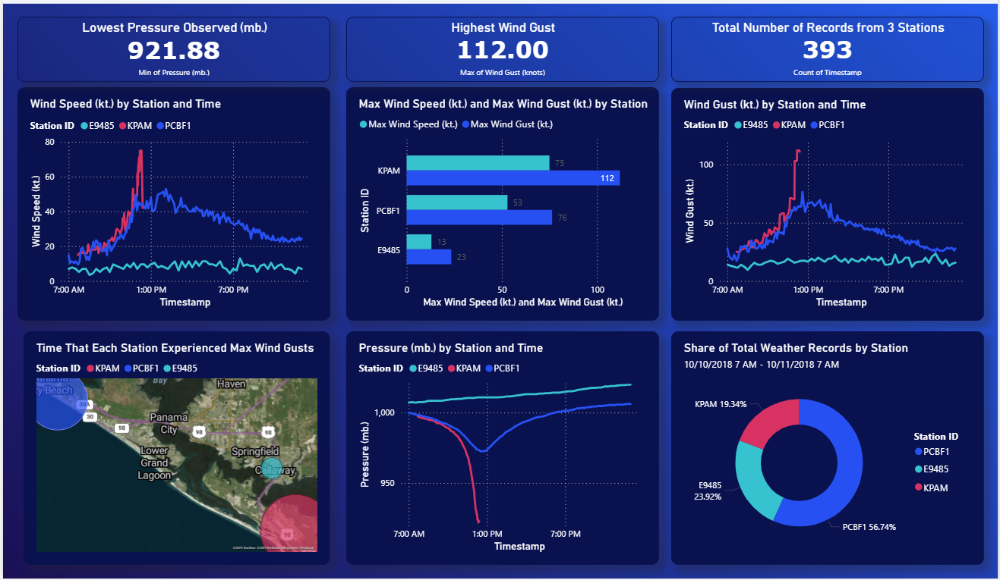

## Hurricane Michael Data Analysis Using SQL and Power BI Project
This project analyzes meteorological data collected during Hurricane Michael in October 2018 (taken from Synoptic Data Weather API) to understand patterns in wind speed, atmospheric pressure, and storm impact across Florida Panhandle weather stations. The goal is to support disaster preparedness and emergency planning through data-driven insights.

